# MIPS-Processor-Simulation

The proposed project is to explore the effects of different cache structures on the read, write and overall average memory access time as well as the total number of stalls in the pipeline due to structural hazards caused by the memory module.

# Repository Structure
The *Benchmarks* folder is as was provided to us, while the remainder is the actual edumips64 implementation. 

All configuration JSON files used for testing can be found in *cache_config/configs/* and the resulting JSON files corresponding to these tests can be found in  *cache_config/results/*. The majority of the cache implementation code is located in *edumips64/cache/*, and the ui adjustments were done in the main class like the other buttons.

The *python/* folder contains all the jupyter notebooks used for calculating the results and generating the graphs of the cache behaviour.

  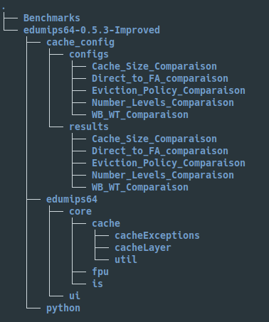

# Cache Abstraction Class Diagram

Below is the class diagram of the new module that was developed to simulate a cache.  TheCacheMan-ageris the most important class were most of the calls from the existing system go through.  thesetupmethod can ingest the file path of the JSON configuration file which will create a set ofDirectMapped-CacheLayerandSetAssociativeCacheLayerobjects that represents the configuration.   Later on,  whenmemory accesses are made, thecalculateLatencymethod is called to calculate how many cycles a parti-cluar access at a specific address takes with the current cache state.The only two concrete classes for Cache layers are theDirectMappedCacheLayerand theSetAssociative-CacheLayerwhich have different internal mechanics for placing and replacing blocks. However both ofthese classes implement theICacheLayerinterface which concists of all methods needed by theCache-Managerto calculate the memory latency for the whole cache structure. The general fields shared amongall types of caches are stored in theCacheLayerabstract class.Lastly, theCacheBlockis the abstraction for a block in the cache.  It is contained by theCacheLayerclass  so  that  it  can  keep  track  of  all  the  block  currently  in  that  layer  and  the  validity  of  each  block.SetAssociativeCacheLayeruses thePriorityCacheBlockto keep track of what to evict next with respectto its eviction policy.

  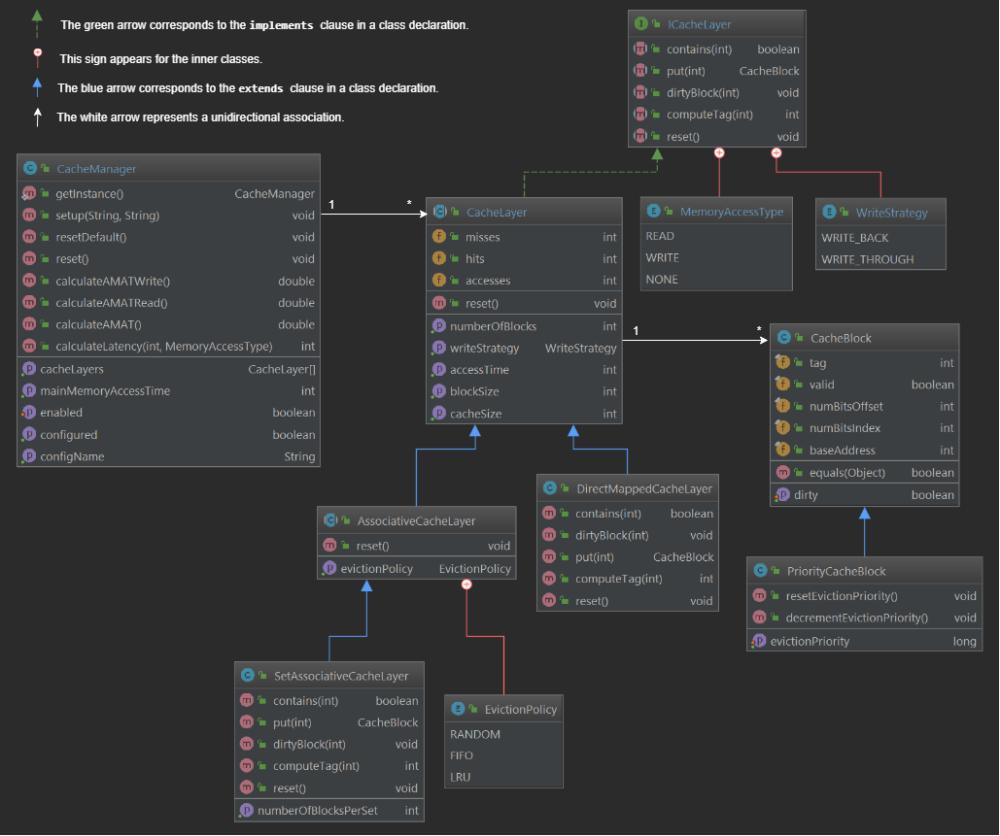

# Results found

For each test, a particular parameter of the cache was changed in an isolated way. The results can be seen in the */pyhon* folder of the improved repository. The metric that is observed is the average memory access time measured in clock cycles.

- [Comparing the associativity](https://github.com/vaquierm/MIPS-Processor-Simulation/blob/master/edumips64-0.5.3-Improved/python/Associativity.ipynb) (From direct mapping to Fully associative)
- [Comparing the cache size to block size ratio](https://github.com/vaquierm/MIPS-Processor-Simulation/blob/master/edumips64-0.5.3-Improved/python/Cache_Block_to_Size_Ratio_Comparaison.ipynb)
- [Comparing the number of levels in the cache](https://github.com/vaquierm/MIPS-Processor-Simulation/blob/master/edumips64-0.5.3-Improved/python/Number_of_levels_comparaison.ipynb)
- [Comparing the replacement policies](https://github.com/vaquierm/MIPS-Processor-Simulation/blob/master/edumips64-0.5.3-Improved/python/Replacement_Policies.ipynb) (For Fully and set associative)
- [Comparing the write strategies](https://github.com/vaquierm/MIPS-Processor-Simulation/blob/master/edumips64-0.5.3-Improved/python/Write_Strategies.ipynb) (*write through* and *write back*)

# How to load a new cache configuration and export statistics

**1. Load the configuration file**

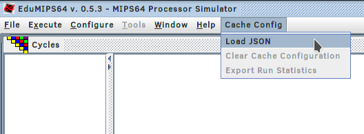
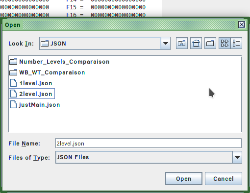
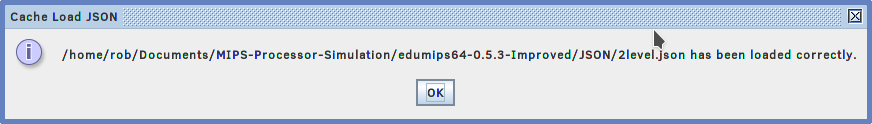

**2. Load the simulation file**

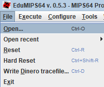

**3. Run the simulation**

*F4* for running te whole progream
*F7* for single step

**4. Export statistics**

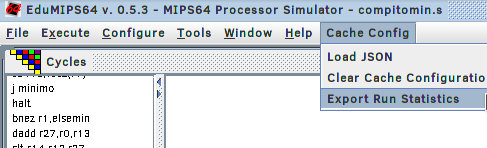
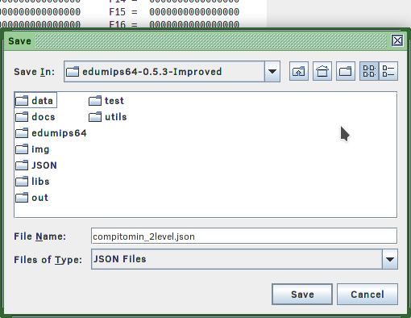

**5. Either: Clear the current cache config or load a new config**

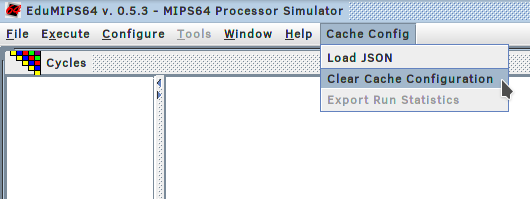
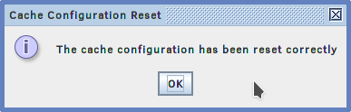

# Format of configuration file

There are certain parameters that are required to load a cache configuration, such as *mmat* and *caches*. *Caches* can be left as an empty list if there are no caches in the specified configuration.  However, if there is a cache object then the following parameters that will need to be provided are *size*, *blockSize*, *accessTime*, *mappingScheme* and *writeStrategy*. *Size* and *blockSize* have to be powers of 2, must have a postfix of *B*, *KB* or *MB* to indicate bytes, kilobytes or megabytes and must have a blockSize smaller or equal to size. *AccessTime* should preferably for a cache be smaller than the main memory access time.
For *mappingScheme* the options are:
- DIRECT
- N_WAY_SET_ASSOCIATIVE_LRU (where N is an integer multiple of 2)
- N_WAY_SET_ASSOCIATIVE_FIFO
- N_WAY_SET_ASSOCIATIVE_RANDOM
- FULLY_ASSOCIATIVE_LRU
- FULLY_ASSOCIATIVE_RANDOM
- FULLY_ASSOCIATIVE_FIFO

Lastly for *writeStrategy*, the available options are:
- WRITEBACK (which uses a write back write allocate strategy)
- WRITETHROUGH (which uses a write through no write allocate strategy)

  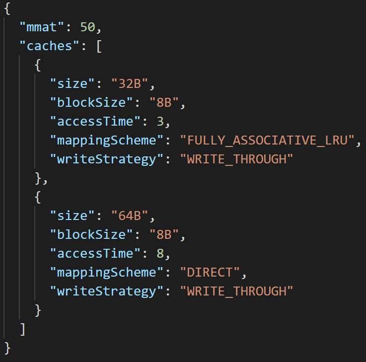

# Format of the result files

The result file contains all the information that was already in the configuration file such that the user can see what the configuration that was used for the run. The name of the benchmark file that the test ran on is also included as *benchmark\_name*. Additionally, the average memory access time overall, for read accesses, and for write accesses (*amat*, *amat_read*, *amat_write*} respectively). Finally, The hit rate of each cache layer is present so that the user can identify were the bottleneck is when the average memory access time is higher than expected.

  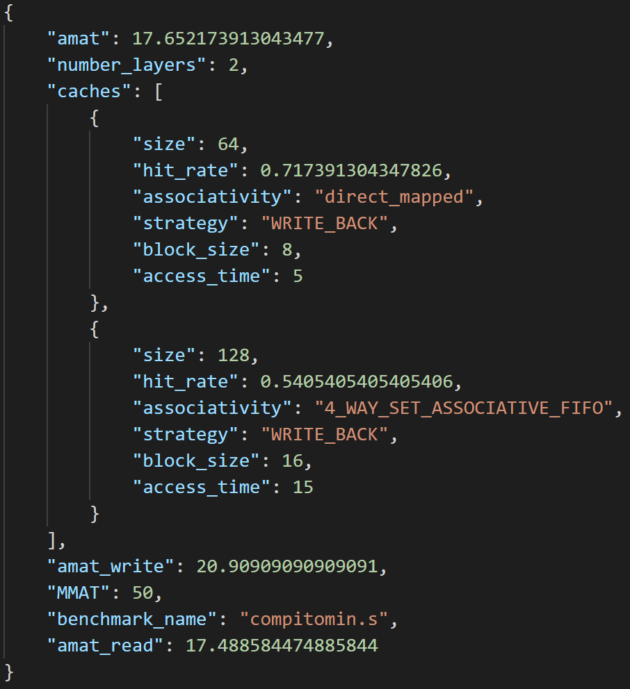

